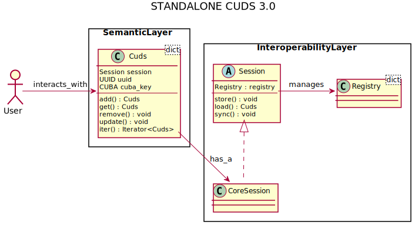
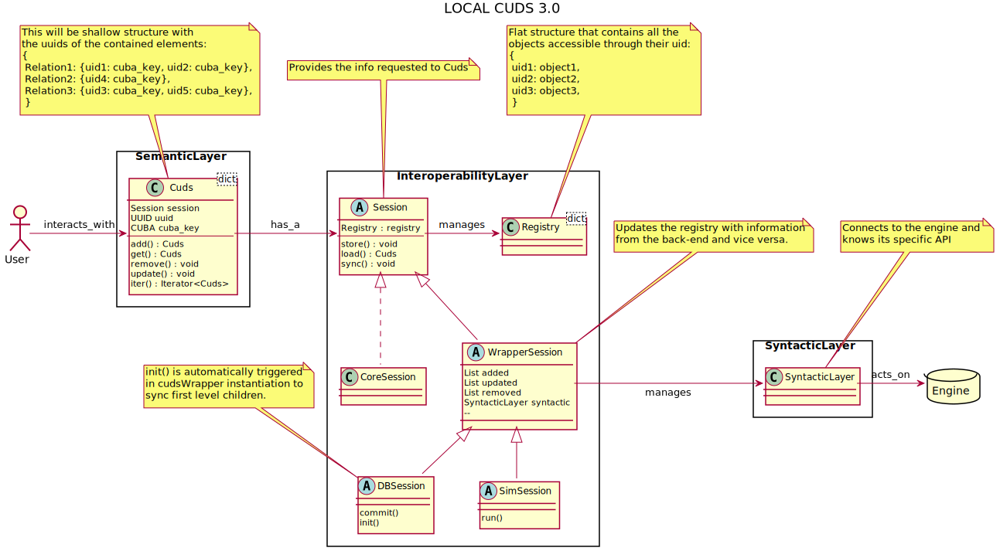
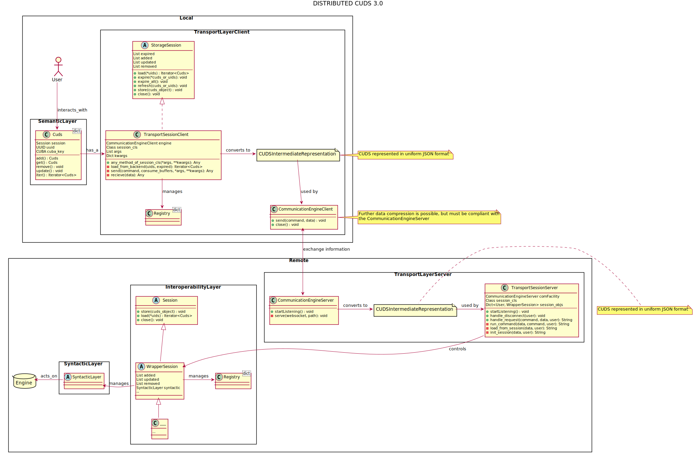

[](https://gitlab.cc-asp.fraunhofer.de/simphony/osp-core/commits/master)
[](https://gitlab.cc-asp.fraunhofer.de/simphony/osp-core/commits/master)

# OSP core

Native implementation of the core cuds object and the class generation
by the SimPhoNy team at Fraunhofer IWM. Builds up on the previous
version, simphony-common (SimPhoNy, EU FP7 Project (Nr. 604005)
www.simphony-project.eu)

Copyright (c) 2018, Adham Hashibon and Materials Informatics Team at
Fraunhofer IWM. All rights reserved. Redistribution and use are limited
to the scope agreed with the end user. No parts of this software may be
used outside of this context. No redistribution is allowed without
explicit written permission.

## Requirements

- PyYaml (on Windows, use <https://stackoverflow.com/a/33673823>) for parsing yaml files
- numpy for vector attributes of cuds
- websockets for the transport layer
- sqlalchemy for the sqlalchemy wrapper
- requests for sending cuds to a server
- unittest2 to run unittests
- pympler for the performance test
- responses for unittesting requests

## Installation

The package requires python 3.6 or higher (tested for 3.7), installation is based on
setuptools:

```sh
# build and install
python3 setup.py install
```

```sh
# using own ontology
python3 setup.py install -o <path/to/ontology.own-ontology.yml>
```

or:

```sh
# build for in-place development
python3 setup.py develop
```

### Installation of OWL ontologies

See doc/conversion_owl_to_yaml.md for working with an OWL ontology. \
See doc/working_with_emmo.md for working with the EMMO.

## Testing

Testing is included in setuptools:

```sh
# run tests automatically
python3 setup.py test
```

They can also be run manually:

```sh
# manually run tests
python3 -m cuds.testing.test_api
```

## Documentation

### API
A standard, simple API has to be defined for the user to interact with OSP:

```python
  import cuds.classes

  a_cuds_object = cuds.classes.ACudsObject()
  a_relationship = cuds.classes.ARelationship
  a_cuba_key = cuds.classes.CUBA.A_CUBA_KEY

  # These will also add the opposed relationship to the new contained entity
  a_cuds_object.add(*other_cuds, rel=a_relationship)
  a_cuds_object.add(yet_another_cuds)                          # Defaults to HAS_PART relationship

  a_cuds_object.get()                                          # Returns the list of all the entities
  a_cuds_object.get(rel=a_relationship)                        # Returns the list of the entities under that relationship
  a_cuds_object.get(*uids)                                     # Searches through all the relationships for the uids
  a_cuds_object.get(*uids, rel=a_relationship)                 # Faster, can filter through the relationship
  a_cuds_object.get(cuba_key=a_cuba_key)                       # Returns the list of all the entities of that type
  a_cuds_object.get(rel=a_relationship, cuba_key=a_cuba_key)   # Returns the list of all the entities of that type under the given relationship

  # These will trigger the update in the opposed relationship of the erased element
  a_cuds_object.remove()                                       # Removes all
  a_cuds_object.remove(*uids/cuds_objects)                     # Searches through all the relationships for the uids/objects to remove
  a_cuds_object.remove(*uids/cuds_objects, rel=a_relationship) # Faster, can filter through the relationship
  a_cuds_object.remove(rel=a_relationship)                     # Delete all elements under a relationship
  a_cuds_object.remove(cuba_key=a_cuba_key)                    # Delete all elements of a certain type
  a_cuds_object.remove(rel=a_relationship, cuba_key=a_cuba_key)# Delete all elements of a certain type under the given relationship

  a_cuds_object.update(*cuds_objects)                          # Searches through all the relationships for the objects to update

  a_cuds_object.iter()                                         # Iterates through all
  a_cuds_object.iter(cuba_key=a_cuba_key)                      # Iterates filtering by the object type
  a_cuds_object.iter(rel=a_relationship)                       # Iterates filtering by the relationship
```

### Data structure

Each cuds object is represented as dictionary.
This contains all the relationships of the cuds object.

For example:

```py
{
    CUBA.REL1: {"obj-uid-001": CUBA.OBJ1, "obj-uid-002": CUBA.OBJ2},
    CUBA.REL2: {"obj-uid-003": CUBA.OBJ3, ...},
    ...
}
```

The related cuds object are referenced by their unique id, the uid.
Each cuds object corresponds to a session.
The session contains a registry that maps every uid to the corresponding cuds object.
Each wrapper has a corresponding session. The default session is an instance of CoreSession.

The attributes are fields of the cuds object:

```py
>>> c = cuds.classes.City(name="Freiburg")
>>> c.name
'Freiburg'
```

### Examples

Further examples can be found in the /examples folder. There the usage of wrappers is explained.

### Directory structure

- cuds -- files necessary for the creation and usage of the cuds.
  - classes -- python classes required for using the cuds.
    - core -- common low level classes and utility code.
    - generated -- generated native cuds implementations.
  - generator -- class generator and template file.
  - ontology -- ontological representation of the cuds.
  - session -- Different abstract classes for wrappers.
  - testing -- unittesting of the code.
- doc -- documentation related files.
- examples -- examples of usage.

### Architecture

The main components, their sub-components, and the interactions between them are given in the following diagrams.

The structure of a pure python OSP case:


The structure of a local wrapper:


The structure of a wrapper with a back-end in a remote server:

